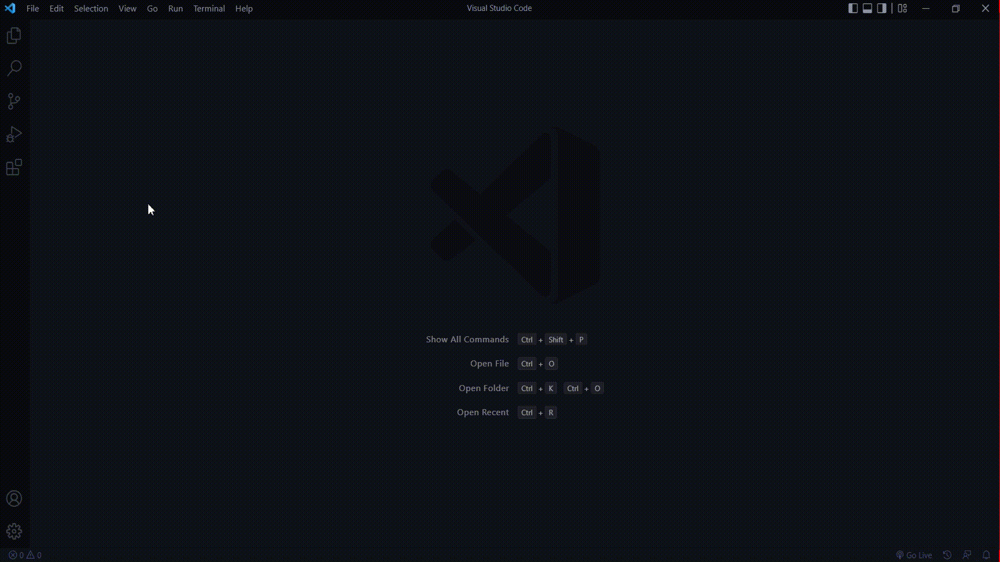

import Extension from '../../src/components/ExtensionCard';

<Extension image="../../../img/extension-logo/bootstrap5.png" name="Bootstrap5 Snippets" about="Snippets for bootstrap5" btn="install" link="https://marketplace.visualstudio.com/items?itemName=NamanGarg.bootstrap5-snippets-helper"/>

Download **Bootstrap5 Snippets** extension from visual studio code's marketplace by clicking here 'Install' above.

