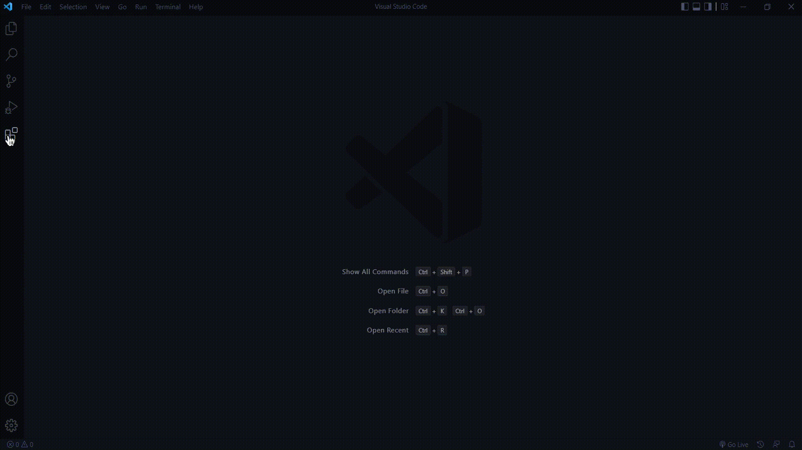

import Extension from '../../src/components/ExtensionCard';

<Extension image="../../img/extension-logo/code-companion.png" name="Code Companion" about="A best code helper" btn="install" link="https://marketplace.visualstudio.com/items?itemName=NamanGarg.CodeCompanion"/>

Download **Code Companion** extensions from visual studio code's marketplace by clicking here 'Install' above.

